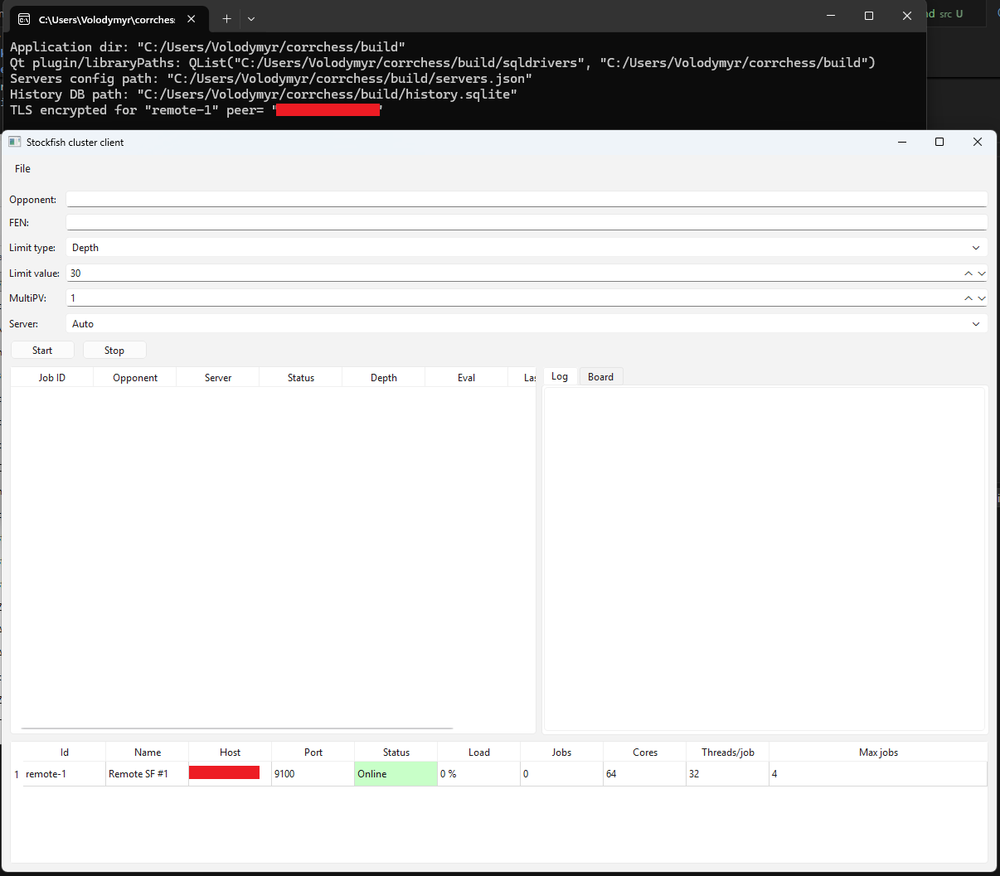
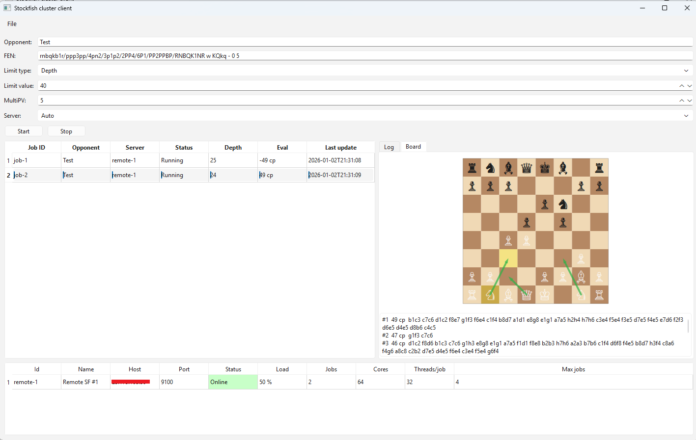

# CorrChess — Stockfish Cluster Client (Qt 6)

CorrChess is a Qt 6 desktop client for managing chess analysis jobs on one or multiple remote Stockfish servers.
This project was originally built for personal use and was not intended as a public/production-grade release.
Its primary goal is to support my own workflow for ICCF correspondence chess tournaments (distributed Stockfish analysis across multiple machines).

The client can:
- submit analysis jobs (FEN, limits, MultiPV),
- receive real-time updates (PV lines, evaluation, depth/seldepth, best move),
- visualize the position with arrows/highlights (Lichess-like),
- persist analysis history (SQLite) and reopen results after restarting the application,
- optionally use mutual TLS (mTLS) so only trusted clients can connect.

---

## Screenshots

### Main UI

### Realtime log

### Realtime Board with PV arrows

---

## Architecture

This project follows a **layered architecture** with a lightweight Clean/Hex influence (partial ports/interfaces).

### Layers / folders
- `src/domain` — core domain model (jobs, snapshots, PV lines, limits)
- `src/app` — use-cases / orchestration (job & server managers)
- `src/infra` — persistence and configuration repositories (SQLite history, config storage)
- `src/net` — network protocol, connections, message parsing/dispatch
- `src/ui` — Qt widgets/models (tables, board view, exporters)
- `src/main.cpp` — **composition root** (dependency wiring)

### Concepts used
- ✅ **Modularity** — code separated into domain/app/infra/net/ui modules
- ✅ **Separation of concerns** — UI does not contain networking/persistence logic
- ✅ **Multilayer approach** — explicit layers with clear responsibilities
- ✅ **Inversion of Control** — composition root wires dependencies (instead of global singletons)
- ✅ **Dependency Injection (manual)** — managers/controllers receive dependencies explicitly
- ✅ **Isolation between layers (pragmatic)** — some infra/net use Qt types (typical for Qt apps)
- ✅ **Law of Demeter (mostly)** — UI talks to app-layer models/managers, not deep chains
- ✅ **Pub/Sub** — Qt signals/slots + event-driven updates from network layer
- ✅ **ACID** — SQLite persistence for history/results (atomic updates, durable storage)
- ✅ **Non-Functional Requirements**
- ✅ **Security**: optional **mTLS**
- ✅ **Reliability**: reconnect/update flow, server-side job restore (when enabled)
- ✅ **Usability**: board + PV list + export tools

### What this is NOT
- ❌ Strict “book” DDD / full Hexagonal (not fully framework-agnostic)

---

## Security: TLS / mTLS (why and how)

The project can run with **mutual TLS authentication**:
- Server presents a TLS certificate (client verifies it using CA)
- Client presents a client certificate (server verifies it using the same CA)
- This prevents “anyone on the internet” from connecting if they don’t have a trusted certificate

This provides:
- encrypted transport (confidentiality),
- server authenticity (no MITM if CA is trusted),
- client authentication (only approved clients).

---

## Persistence: view results after restart

Analysis results are persisted in SQLite:
- client keeps local history (jobs list, snapshots, PV lines, logs tail),
- optionally, server can persist jobs and restore them on reconnect (if enabled in server build).

So even after closing the app, you can open it again and browse past analyses.

---

### Requirements
- Qt 6 (Core, Widgets, Network, SQL)
- CMake + a C++17 compiler
- SQLite (via Qt SQL driver)